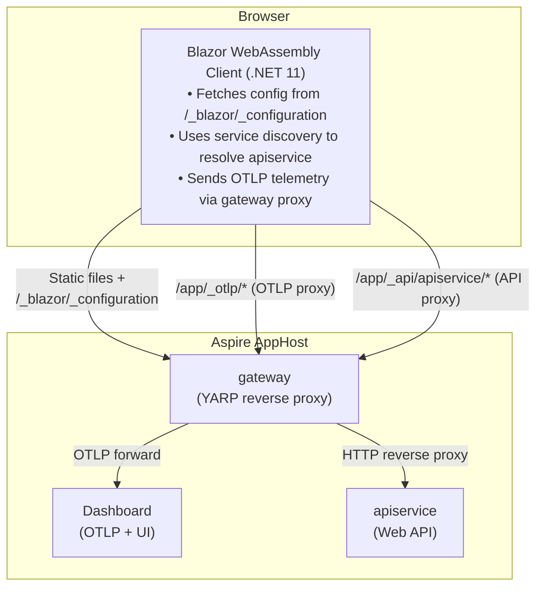
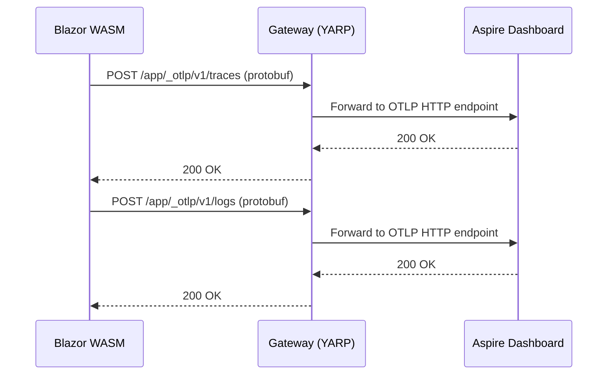

# BlazorStandalone

This sample demonstrates how to integrate a **standalone Blazor WebAssembly** application with Aspire, enabling full observability (logs, traces) and service discovery without requiring a hosted Blazor Server backend.

## Overview

For **standalone** Blazor WebAssembly applications, there is no server-side Blazor host. This sample uses the `Aspire.Hosting.Blazor` package to automatically generate a **Gateway** (an ASP.NET Core + YARP reverse proxy) that:

- Serves the WASM static files under a path prefix (e.g., `/app/`)
- Exposes a `/_blazor/_configuration` endpoint with service URLs and OTLP settings
- Proxies API traffic to backend services via YARP
- Proxies OTLP telemetry from the browser to the Aspire dashboard

This enables:

- **Service Discovery** — resolve service endpoints at runtime
- **Distributed Tracing** — traces flow from browser → gateway → API → dashboard
- **Structured Logging** — client-side logs appear in Aspire dashboard

## Architecture



## How It Works

### Step 1: AppHost Registers the WASM App and Gateway

The `Aspire.Hosting.Blazor` package provides `AddBlazorWasmProject` and `AddBlazorGateway` APIs. The AppHost declares the WASM app, its service dependencies, and the gateway:

```csharp
var builder = DistributedApplication.CreateBuilder(args);

var apiService = builder.AddProject<Projects.BlazorStandalone_ApiService>("apiservice")
    .WithHttpHealthCheck("/health");

// Register the WASM app — the resource name becomes the URL path prefix (e.g., /app/)
var blazorApp = builder.AddBlazorWasmProject<Projects.BlazorStandalone>("app")
    .WithReference(apiService);

// The Gateway serves WASM files and proxies API + OTLP traffic
builder.AddBlazorGateway("gateway")
    .WithExternalHttpEndpoints()
    .WithOtlpExporter()
    .WithBlazorClientApp(blazorApp);

builder.Build().Run();
```

> **Note on `WithOtlpExporter()`:** The official playground uses
> `.WithOtlpExporter(OtlpProtocol.HttpProtobuf)`. On the public nuget.org
> `Aspire.Hosting.Blazor 13.4.5-preview` package, that protocol makes the generated
> `Gateway.cs` fail at startup with a circular `ILoggerFactory` dependency
> (the gateway's own OTLP **log** exporter resolves an `IHttpClientFactory` that needs
> `ILoggerFactory` while it is still being built). Using the default (gRPC) for the
> gateway's **own** telemetry avoids the crash; **client** (browser) telemetry is
> unaffected because it is proxied separately over HTTP/protobuf via `/app/_otlp/`.
> See the "Versions & preview notes" section below.

At startup, the hosting layer:
1. Reads the WASM project's `staticwebassets.build.json` manifest to locate static files
2. Generates a `Gateway.cs` script that configures YARP routes for each WASM client
3. Builds a client configuration JSON with service URLs and OTLP settings
4. Launches the gateway as a project resource

### Step 2: Gateway Exposes Configuration Endpoint

The gateway serves a `/_blazor/_configuration` endpoint that returns the configuration needed by the WASM client:

```json
{
  "webAssembly": {
    "environment": {
      "services__apiservice__https__0": "https://localhost:63807/app/_api/apiservice",
      "services__apiservice__http__0": "https://localhost:63807/app/_api/apiservice",
      "OTEL_SERVICE_NAME": "app",
      "OTEL_EXPORTER_OTLP_ENDPOINT": "/app/_otlp",
      "OTEL_EXPORTER_OTLP_PROTOCOL": "http/protobuf"
    }
  }
}
```

Note: `OTEL_EXPORTER_OTLP_ENDPOINT` is a **relative** path (`/app/_otlp`). The client resolves
it against `HostEnvironment.BaseAddress` so telemetry is sent to the same origin the user
navigated to (the gateway's `/app/_otlp/` proxy), which forwards it to the Aspire dashboard.
This avoids cross-origin issues. The dashboard OTLP API-key header is **not** sent to the
browser; the gateway injects it server-side when forwarding.

### Step 3: JavaScript Initializer Injects Environment Variables

The **ClientServiceDefaults** library includes a [JavaScript initializer](https://learn.microsoft.com/aspnet/core/blazor/fundamentals/startup#javascript-initializers) that runs when the .NET runtime config is loaded:

```javascript
export async function onRuntimeConfigLoaded(config) {
    const configUrl = new URL('_blazor/_configuration', document.baseURI).href;
    const response = await fetch(configUrl);
    if (response.ok) {
        const serverConfig = await response.json();
        const envVars = serverConfig?.webAssembly?.environment;
        if (envVars && Object.keys(envVars).length > 0) {
            config.environmentVariables ??= {};
            for (const [key, value] of Object.entries(envVars)) {
                config.environmentVariables[key] = value;
            }
        }
    }
}
```

This makes configuration available via `Environment.GetEnvironmentVariable()` in the WASM client.

### Step 4: WASM Client Bridges Environment Variables into IConfiguration

Environment variables are available via `Environment.GetEnvironmentVariable()`, but **not** automatically in `IConfiguration`. Since Service Discovery reads from `IConfiguration`, we bridge this gap:

```csharp
var builder = WebAssemblyHostBuilder.CreateDefault(args);

// Bridge environment variables into IConfiguration
// Converts "services__weatherapi__https__0" → "services:weatherapi:https:0"
builder.Configuration.AddEnvironmentVariables();

// Add Aspire client service defaults (OpenTelemetry, service discovery, resilience)
builder.AddBlazorClientServiceDefaults();

// Named HttpClient using service discovery
builder.Services.AddHttpClient("apiservice", client =>
{
    client.BaseAddress = new Uri("https+http://apiservice");
});
```

### Step 5: Telemetry Flows to Aspire Dashboard

The **ClientServiceDefaults** package configures OpenTelemetry to send logs and traces to the OTLP endpoint (which points to the gateway's `/_otlp/` proxy). The gateway forwards this traffic to the Aspire dashboard.



**Note:** As of .NET 11 ([dotnet/aspnetcore#63814](https://github.com/dotnet/aspnetcore/pull/63814)), `WebAssemblyHost` runs `IHostedService` implementations on startup. OpenTelemetry's `TelemetryHostedService` therefore initializes the tracer and meter providers automatically — no manual `GetService<MeterProvider>()` / `GetService<TracerProvider>()` call is required:

```csharp
var host = builder.Build();

await host.RunAsync();
```

> On .NET 10 (e.g. the Aspire `playground/BlazorStandalone` sample) WASM does **not** run hosted services, so those samples still force provider initialization manually.

## Project Structure

```text
BlazorStandalone/
├── BlazorStandalone.AppHost/                # Aspire orchestrator (net10.0)
│   ├── AppHost.cs                               # AddBlazorWasmProject + AddBlazorGateway
│   └── Properties/launchSettings.json           # Dashboard gRPC + HTTP OTLP endpoints
│
├── BlazorStandalone/                        # Standalone Blazor WASM client (net11.0)
│   ├── Program.cs                               # AddEnvironmentVariables() + service discovery
│   └── Pages/Weather.razor                      # Calls apiservice via IHttpClientFactory
│
├── BlazorStandalone.ClientServiceDefaults/  # WASM-side telemetry + config (net11.0)
│   ├── Extensions.cs                            # AddBlazorClientServiceDefaults()
│   ├── BackgroundExportHandler.cs              # WASM-safe fire-and-forget OTLP export
│   └── wwwroot/*.lib.module.js                  # JS initializer: fetches /_blazor/_configuration
│
├── BlazorStandalone.ServiceDefaults/        # Server-side Aspire defaults (net10.0)
│   └── Extensions.cs                            # Standard AddServiceDefaults()
│
└── BlazorStandalone.ApiService/             # Sample API (net10.0)
    └── Program.cs                              # Minimal API with /weatherforecast
```

## Running the Sample

1. **Start the AppHost:**
   ```bash
   cd BlazorStandalone.AppHost
   dotnet run
   ```

2. **Open the Aspire Dashboard** using the login URL from the console output

3. **Navigate to the WASM app** — click the gateway URL in the Resources page, then append `/app/`

4. **Click "Weather"** to trigger an API call through the YARP proxy

5. **View telemetry** in the Aspire dashboard:
   - **Structured Logs** — logs from `gateway` (server) and `app` (WASM client)
   - **Traces** — distributed traces: `app` → `gateway` → `apiservice`
   - **Metrics** — client metrics export every **5s** (set via
     `PeriodicExportingMetricReaderOptions.ExportIntervalMilliseconds` in
     `ClientServiceDefaults/Extensions.cs`) so they appear quickly during a live demo, rather than
     the OpenTelemetry SDK default of 60s.

## Versions & preview notes

This sample targets **Aspire 13.4** (public nuget.org packages) with a **.NET 11 Preview 5**
Blazor WebAssembly client. The server projects (AppHost, ApiService, ServiceDefaults) target
`net10.0`; the WASM client and its ClientServiceDefaults target `net11.0`.

The Blazor hosting integration is preview-only. The latest publicly published versions used here:

| Package | Version | Source |
|---------|---------|--------|
| `Aspire.AppHost.Sdk` | `13.4.5` | nuget.org |
| `Aspire.Hosting.Blazor` | `13.4.5-preview.1.26316.12` | nuget.org |
| `Microsoft.AspNetCore.Components.WebAssembly` | `11.0.0-preview.5.*` | nuget.org |

Because Preview 5 predates the upstream "align gateway and templates" work, five minimal
adjustments are applied versus a naive scaffold. All are bridges for known preview-era gaps
and can be reverted once the fixes ship publicly:

1. **AppHost `launchSettings.json` adds `ASPIRE_DASHBOARD_OTLP_HTTP_ENDPOINT_URL`.** The
   `aspire-starter` template only emits the gRPC OTLP endpoint, but WASM clients export via
   HTTP/protobuf, so the gateway needs the dashboard's **HTTP** OTLP endpoint to proxy client
   telemetry. (The official playground `launchSettings.json` includes this.) On the public
   `13.4.5-preview` package, `BlazorGatewayExtensions.ResolveHttpOtlpEndpointUrl` only reads this
   config key; without it the gateway logs *"no dashboard HTTP endpoint could be resolved"* and
   emits no client OTLP config. The post-fix resolver on `microsoft/aspire` `main` first looks the
   dashboard's `otlp-http` endpoint up from the application model (handling randomized ports), so
   the manual entry can be dropped once that ships. _Tracking:_
   [dotnet/aspnetcore#64574](https://github.com/dotnet/aspnetcore/issues/64574) (WASM service
   defaults epic), [microsoft/aspire#15691](https://github.com/microsoft/aspire/pull/15691) /
   [#17384](https://github.com/microsoft/aspire/pull/17384) (gateway integration + follow-up).

2. **Gateway self-export uses gRPC (`WithOtlpExporter()`), not `HttpProtobuf`.** Works around a
   circular `ILoggerFactory` dependency that crashes the generated `Gateway.cs` on the public
   `13.4.5-preview` package (the gateway's own `OtlpLogExporter` → `IHttpClientFactory` →
   `AddStandardResilienceHandler` Polly telemetry → `ILoggerFactory` while it is still being
   built). Client telemetry is unaffected (proxied over HTTP/protobuf). _Tracking:_
   [dotnet/aspnetcore#67032](https://github.com/dotnet/aspnetcore/issues/67032) (the
   `CircularDependencyException` — its repro explicitly includes the Aspire AppHost + standalone
   WASM + ServiceDefaults scenario), fixed by
   [#67048](https://github.com/dotnet/aspnetcore/pull/67048), which reworks both the client
   `ServiceDefaults` template (see #3) **and** the gateway's own telemetry setup
   (`BlazorGateway.cs` → `CreateSlimBuilder` + conditional `ConfigureOpenTelemetry`). The fix is
   not yet in a public `Aspire.Hosting.Blazor` package, so the gRPC workaround remains until the
   package bundles the post-#67048 gateway.

3. **`ClientServiceDefaults/Extensions.cs` resolves the OTLP endpoint against
   `HostEnvironment.BaseAddress`** and sets explicit `v1/logs` / `v1/traces` / `v1/metrics`
   endpoints — matching the post-Preview-5 template. The Preview 5 `dotnet new
   blazor-wasm-servicedefaults` template called bare `AddOtlpExporter()`, which does not handle
   the relative `/app/_otlp` endpoint the gateway emits. _Tracking:_
   [dotnet/aspnetcore#67048](https://github.com/dotnet/aspnetcore/pull/67048) (template/gateway
   alignment, post-Preview-5), [#64574](https://github.com/dotnet/aspnetcore/issues/64574) (epic),
   and the root OTel-in-WASM issue
   [open-telemetry/opentelemetry-dotnet#2816](https://github.com/open-telemetry/opentelemetry-dotnet/issues/2816).

4. **`ClientServiceDefaults/Extensions.cs` gives the OTLP export handler a `NullLogger` instead of
   resolving the app's `ILoggerFactory`.** On Preview 5, the OTLP *log* exporter builds its
   `HttpClient` (via the `IPostConfigureOptions<OtlpExporterOptions>` `HttpClientFactory`) while the
   `ILoggerFactory` is still being constructed, so resolving `ILoggerFactory` there throws
   `CircularDependencyException` and the WASM app fails to boot — the **client-side** manifestation
   of [dotnet/aspnetcore#67032](https://github.com/dotnet/aspnetcore/issues/67032). App log
   telemetry still flows (via `logging.AddOtlpExporter`); only the handler's own retry diagnostics
   are not logged. Verified end-to-end with a headless browser: the app boots and the Weather page
   loads forecasts via service discovery with no `CircularDependencyException`. The official
   post-#67048 template still resolves `ILoggerFactory`; it relies on a post-Preview-5 runtime fix,
   so this `NullLogger` shim can be reverted once that runtime ships.

5. **`BlazorStandalone.csproj` enables WASM runtime diagnostics feature switches.** Blazor
   WebAssembly trims diagnostics by default, so without these the client emits **no metrics and no
   traces** (instruments become no-ops and `HttpClient` never creates `Activity` spans):

   ```xml
   <MetricsSupport>true</MetricsSupport>
   <EventSourceSupport>true</EventSourceSupport>
   <HttpActivityPropagationSupport>true</HttpActivityPropagationSupport>
   <!-- plus -->
   <RuntimeHostConfigurationOption Include="System.Net.Http.EnableActivityPropagation" Value="true" />
   ```

   The official playground sets these explicitly. They are needed because the runtime change to turn
   metrics/EventSource support on by default in WASM did **not** land for Preview 5 — once it ships,
   these switches can be removed. Verified end-to-end with a headless browser: after adding the
   switches, the client exports both `v1/metrics` and `v1/traces` (previously traces were absent).
   _Tracking:_ [dotnet/aspnetcore#64575](https://github.com/dotnet/aspnetcore/issues/64575) (enable
   WASM metrics/EventSource support by default).

References:
- Official sample: [`microsoft/aspire` · `playground/BlazorStandalone`](https://github.com/microsoft/aspire/tree/main/playground/BlazorStandalone)
- WASM service defaults template epic: [`dotnet/aspnetcore#64574`](https://github.com/dotnet/aspnetcore/issues/64574)
- Gateway/config rework: [`microsoft/aspire#17384`](https://github.com/microsoft/aspire/pull/17384)
- Template/gateway alignment (post-Preview-5): [`dotnet/aspnetcore#67048`](https://github.com/dotnet/aspnetcore/pull/67048)
- ILoggerFactory `CircularDependencyException` (client + gateway): [`dotnet/aspnetcore#67032`](https://github.com/dotnet/aspnetcore/issues/67032)
- Hosted services in `WebAssemblyHost`: [`dotnet/aspnetcore#63814`](https://github.com/dotnet/aspnetcore/pull/63814)
- Root OpenTelemetry-in-WASM issue: [`open-telemetry/opentelemetry-dotnet#2816`](https://github.com/open-telemetry/opentelemetry-dotnet/issues/2816)
- Enable WASM metrics/EventSource support by default: [`dotnet/aspnetcore#64575`](https://github.com/dotnet/aspnetcore/issues/64575)

Conversely, **.NET 11 removes** one workaround that earlier samples needed: `WebAssemblyHost`
now runs `IHostedService` ([dotnet/aspnetcore#63814](https://github.com/dotnet/aspnetcore/pull/63814)),
so OpenTelemetry's providers start automatically and there's no manual `GetService<MeterProvider>()`
/ `GetService<TracerProvider>()` call. The .NET 10 playground sample still carries that workaround.

## Key Differences from Hosted Blazor

| Aspect | Hosted Blazor | Standalone with Gateway |
|--------|---------------|------------------------|
| **Server** | Blazor Server hosts WASM | Auto-generated Gateway hosts WASM |
| **Config delivery** | DOM comment in rendered HTML | `/_blazor/_configuration` endpoint |
| **JS initializer** | `beforeWebAssemblyStart` | `onRuntimeConfigLoaded` |
| **Telemetry proxy** | Through server's `/_otlp/*` route | Through gateway's `/_otlp/*` route |
| **Service discovery** | Works out of the box | Requires `AddEnvironmentVariables()` |
| **Client discriminator** | `(client)` suffix on service name | Separate resource name (e.g., `app`) |
| **CORS** | Not needed (same origin) | Not needed (gateway is same origin) |
