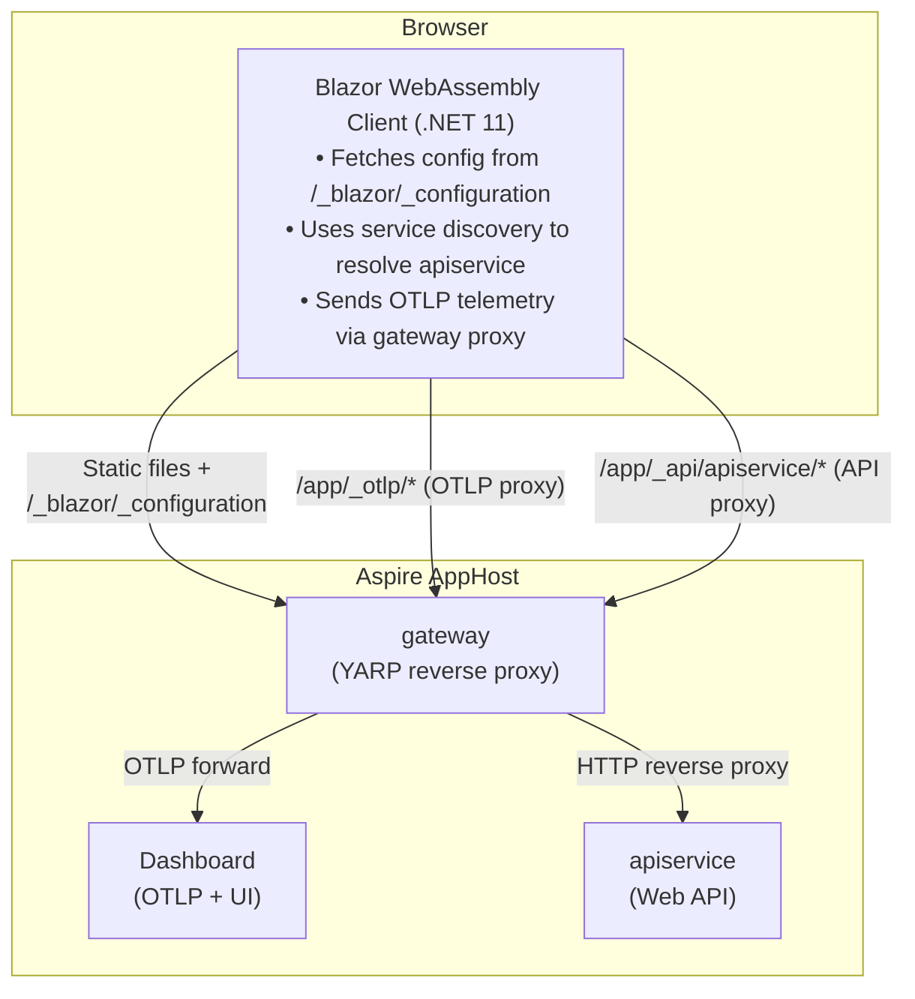
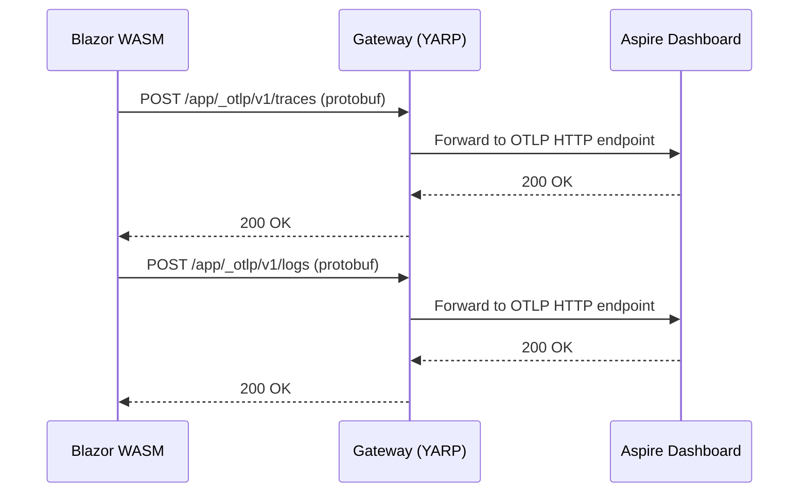

# BlazorStandalone

This sample demonstrates how to integrate a **standalone Blazor WebAssembly** application with Aspire, enabling full observability (logs, traces) and service discovery without requiring a hosted Blazor Server backend.

## Overview

For **standalone** Blazor WebAssembly applications, there is no server-side Blazor host. This sample uses the `Aspire.Hosting.Blazor` package to automatically generate a **Gateway** (an ASP.NET Core + YARP reverse proxy) that:

- Serves the WASM static files under a path prefix (e.g., `/app/`)
- Exposes a `/_blazor/_configuration` endpoint with service URLs and OTLP settings
- Proxies API traffic to backend services via YARP
- Proxies OTLP telemetry from the browser to the Aspire dashboard

This enables:

- **Service Discovery** — resolve service endpoints at runtime
- **Distributed Tracing** — traces flow from browser → gateway → API → dashboard
- **Structured Logging** — client-side logs appear in Aspire dashboard

## Architecture


```mermaid
graph TB
    subgraph AppHost["Aspire AppHost"]
        Dashboard["Dashboard<br/>(OTLP + UI)"]
        Gateway["gateway<br/>(YARP reverse proxy)"]
        ApiService["apiservice<br/>(Web API)"]
    end

    subgraph Browser
        WASM["Blazor WebAssembly Client (.NET 11)<br/>• Fetches config from /_blazor/_configuration<br/>• Uses service discovery to resolve apiservice<br/>• Sends OTLP telemetry via gateway proxy"]
    end

    WASM -- "Static files +<br/>/_blazor/_configuration" --> Gateway
    WASM -- "/app/_otlp/* (OTLP proxy)" --> Gateway
    WASM -- "/app/_api/apiservice/* (API proxy)" --> Gateway
    Gateway -- "OTLP forward" --> Dashboard
    Gateway -- "HTTP reverse proxy" --> ApiService
```

## How It Works

### Step 1: AppHost Registers the WASM App and Gateway

The `Aspire.Hosting.Blazor` package provides `AddBlazorWasmProject` and `AddBlazorGateway` APIs. The AppHost declares the WASM app, its service dependencies, and the gateway:

```csharp
var builder = DistributedApplication.CreateBuilder(args);

var apiService = builder.AddProject<Projects.BlazorStandalone_ApiService>("apiservice")
    .WithHttpHealthCheck("/health");

// Register the WASM app — the resource name becomes the URL path prefix (e.g., /app/)
var blazorApp = builder.AddBlazorWasmProject<Projects.BlazorStandalone>("app")
    .WithReference(apiService);

// The Gateway serves WASM files and proxies API + OTLP traffic
builder.AddBlazorGateway("gateway")
    .WithExternalHttpEndpoints()
    .WithOtlpExporter()
    .WithBlazorClientApp(blazorApp);

builder.Build().Run();
```

> **Note on `WithOtlpExporter()`:** The official playground uses
> `.WithOtlpExporter(OtlpProtocol.HttpProtobuf)`. On the public nuget.org
> `Aspire.Hosting.Blazor 13.4.6-preview` package, that protocol makes the generated
> `Gateway.cs` fail at startup with a circular `ILoggerFactory` dependency
> (the gateway's own OTLP **log** exporter resolves an `IHttpClientFactory` that needs
> `ILoggerFactory` while it is still being built). Using the default (gRPC) for the
> gateway's **own** telemetry avoids the crash; **client** (browser) telemetry is
> unaffected because it is proxied separately over HTTP/protobuf via `/app/_otlp/`.
> See the "Versions & preview notes" section below.

At startup, the hosting layer:
1. Reads the WASM project's `staticwebassets.build.json` manifest to locate static files
2. Generates a `Gateway.cs` script that configures YARP routes for each WASM client
3. Builds a client configuration JSON with service URLs and OTLP settings
4. Launches the gateway as a project resource

### Step 2: Gateway Exposes Configuration Endpoint

The gateway serves a `/_blazor/_configuration` endpoint that returns the configuration needed by the WASM client:

```json
{
  "webAssembly": {
    "environment": {
      "services__apiservice__https__0": "https://localhost:63807/app/_api/apiservice",
      "services__apiservice__http__0": "https://localhost:63807/app/_api/apiservice",
      "OTEL_SERVICE_NAME": "app",
      "OTEL_EXPORTER_OTLP_ENDPOINT": "/app/_otlp",
      "OTEL_EXPORTER_OTLP_PROTOCOL": "http/protobuf"
    }
  }
}
```

Note: `OTEL_EXPORTER_OTLP_ENDPOINT` is a **relative** path (`/app/_otlp`). The client resolves
it against `HostEnvironment.BaseAddress` so telemetry is sent to the same origin the user
navigated to (the gateway's `/app/_otlp/` proxy), which forwards it to the Aspire dashboard.
This avoids cross-origin issues. The dashboard OTLP API-key header is **not** sent to the
browser; the gateway injects it server-side when forwarding.

### Step 3: JavaScript Initializer Injects Environment Variables

The **ClientServiceDefaults** library includes a [JavaScript initializer](https://learn.microsoft.com/aspnet/core/blazor/fundamentals/startup#javascript-initializers) that runs when the .NET runtime config is loaded:

```javascript
export async function onRuntimeConfigLoaded(config) {
    const configUrl = new URL('_blazor/_configuration', document.baseURI).href;
    const response = await fetch(configUrl);
    if (response.ok) {
        const serverConfig = await response.json();
        const envVars = serverConfig?.webAssembly?.environment;
        if (envVars && Object.keys(envVars).length > 0) {
            config.environmentVariables ??= {};
            for (const [key, value] of Object.entries(envVars)) {
                config.environmentVariables[key] = value;
            }
        }
    }
}
```

This makes configuration available via `Environment.GetEnvironmentVariable()` in the WASM client.

### Step 4: WASM Client Bridges Environment Variables into IConfiguration

Environment variables are available via `Environment.GetEnvironmentVariable()`, but **not** automatically in `IConfiguration`. Since Service Discovery reads from `IConfiguration`, we bridge this gap:

```csharp
var builder = WebAssemblyHostBuilder.CreateDefault(args);

// Bridge environment variables into IConfiguration
// Converts "services__weatherapi__https__0" → "services:weatherapi:https:0"
builder.Configuration.AddEnvironmentVariables();

// Add Aspire client service defaults (OpenTelemetry, service discovery, resilience)
builder.AddBlazorClientServiceDefaults();

// Named HttpClient using service discovery
builder.Services.AddHttpClient("apiservice", client =>
{
    client.BaseAddress = new Uri("https+http://apiservice");
});
```

### Step 5: Telemetry Flows to Aspire Dashboard

The **ClientServiceDefaults** package configures OpenTelemetry to send logs and traces to the OTLP endpoint (which points to the gateway's `/_otlp/` proxy). The gateway forwards this traffic to the Aspire dashboard.


```mermaid
sequenceDiagram
    participant WASM as Blazor WASM
    participant GW as Gateway (YARP)
    participant DB as Aspire Dashboard

    WASM->>GW: POST /app/_otlp/v1/traces (protobuf)
    GW->>DB: Forward to OTLP HTTP endpoint
    DB-->>GW: 200 OK
    GW-->>WASM: 200 OK

    WASM->>GW: POST /app/_otlp/v1/logs (protobuf)
    GW->>DB: Forward to OTLP HTTP endpoint
    DB-->>GW: 200 OK
    GW-->>WASM: 200 OK
```

**Note:** As of .NET 11 ([dotnet/aspnetcore#63814](https://github.com/dotnet/aspnetcore/pull/63814)), `WebAssemblyHost` runs `IHostedService` implementations on startup. OpenTelemetry's `TelemetryHostedService` therefore initializes the tracer and meter providers automatically — no manual `GetService<MeterProvider>()` / `GetService<TracerProvider>()` call is required:

```csharp
var host = builder.Build();

await host.RunAsync();
```

> On .NET 10 (e.g. the Aspire `playground/BlazorStandalone` sample) WASM does **not** run hosted services, so those samples still force provider initialization manually.

## Project Structure

```text
BlazorStandalone/
├── BlazorStandalone.AppHost/                # Aspire orchestrator (net10.0)
│   ├── AppHost.cs                               # AddBlazorWasmProject + AddBlazorGateway
│   └── Properties/launchSettings.json           # Dashboard gRPC + HTTP OTLP endpoints
│
├── BlazorStandalone/                        # Standalone Blazor WASM client (net11.0)
│   ├── Program.cs                               # AddEnvironmentVariables() + service discovery
│   └── Pages/Weather.razor                      # Calls apiservice via IHttpClientFactory
│
├── BlazorStandalone.ClientServiceDefaults/  # WASM-side telemetry + config (net11.0)
│   │                                            # Generated by `dotnet new blazorwasm-servicedefaults`
│   │                                            # (Preview 6). Keep in sync with the template.
│   ├── Extensions.cs                            # AddBlazorClientServiceDefaults()
│   ├── BackgroundExportHandler.cs              # WASM-safe fire-and-forget OTLP export
│   └── wwwroot/*.lib.module.js                  # JS initializer: fetches /_blazor/_configuration
│
├── BlazorStandalone.ServiceDefaults/        # Server-side Aspire defaults (net10.0)
│   └── Extensions.cs                            # Standard AddServiceDefaults()
│
└── BlazorStandalone.ApiService/             # Sample API (net10.0)
    └── Program.cs                              # Minimal API with /weatherforecast
```

## Running the Sample

1. **Start the AppHost:**
   ```bash
   cd BlazorStandalone.AppHost
   dotnet run
   ```

2. **Open the Aspire Dashboard** using the login URL from the console output

3. **Navigate to the WASM app** — click the gateway URL in the Resources page, then append `/app/`

4. **Click "Weather"** to trigger an API call through the YARP proxy

5. **View telemetry** in the Aspire dashboard:
   - **Structured Logs** — logs from `gateway` (server) and `app` (WASM client)
   - **Traces** — distributed traces: `app` → `gateway` → `apiservice`
   - **Metrics** — client metrics export every **5s** (set via
     `PeriodicExportingMetricReaderOptions.ExportIntervalMilliseconds` in
     `ClientServiceDefaults/Extensions.cs`) so they appear quickly during a live demo, rather than
     the OpenTelemetry SDK default of 60s.

## Versions & preview notes

This sample targets **Aspire 13.4** (public nuget.org packages) with a **.NET 11 Preview 6**
Blazor WebAssembly client. The server projects (AppHost, ApiService, ServiceDefaults) target
`net10.0`; the WASM client and its ClientServiceDefaults target `net11.0`.

The Blazor hosting integration is preview-only. The latest publicly published versions used here:

| Package | Version | Source |
|---------|---------|--------|
| `Aspire.AppHost.Sdk` | `13.4.6` | nuget.org |
| `Aspire.Hosting.Blazor` | `13.4.6-preview.1.26319.6` | nuget.org |
| `Microsoft.AspNetCore.Components.WebAssembly` | `11.0.0-preview.6.*` | nuget.org |

> **Re-verified against these versions (Aspire CLI 13.4.6, `Aspire.Hosting.Blazor`
> 13.4.6-preview, .NET 11 Preview 6).** The adjustments below were originally characterized
> against Preview 5. Each one has since been re-tested with a live run; **two were dropped** and
> the remaining three are documented with the evidence that they are still needed.

The **ClientServiceDefaults** project is now byte-identical to the
`dotnet new blazorwasm-servicedefaults` template shipped in the Preview 6 SDK, apart from a single
clearly-marked demo divergence (a 5s metric export interval instead of the SDK default of 60s, so
client metrics appear on the dashboard while on stage). Prefer keeping it that way: if you need to
change client telemetry behavior, check the template first.

Three minimal adjustments remain versus a naive scaffold. All are bridges for known preview-era
gaps and can be reverted once the fixes ship publicly:

1. **AppHost `launchSettings.json` adds `ASPIRE_DASHBOARD_OTLP_HTTP_ENDPOINT_URL`.** The
   `aspire-starter` template only emits the gRPC OTLP endpoint, but WASM clients export via
   HTTP/protobuf, so the gateway needs the dashboard's **HTTP** OTLP endpoint to proxy client
   telemetry. `BlazorGatewayExtensions.ResolveHttpOtlpEndpointUrl` only reads this config key.
   The post-fix resolver on `microsoft/aspire` `main` looks the dashboard's `otlp-http` endpoint
   up from the application model instead, so the manual entry can be dropped once that ships.
   _Still required on 13.4.6_ — verified by removing it and re-running: `/_blazor/_configuration`
   drops `OTEL_SERVICE_NAME`, `OTEL_EXPORTER_OTLP_ENDPOINT` and `OTEL_EXPORTER_OTLP_PROTOCOL`
   entirely, leaving only the service-discovery URLs, so the client emits no telemetry at all.
   _Tracking:_ [dotnet/aspnetcore#64574](https://github.com/dotnet/aspnetcore/issues/64574),
   [microsoft/aspire#15691](https://github.com/microsoft/aspire/pull/15691) /
   [#17384](https://github.com/microsoft/aspire/pull/17384).

2. **Gateway self-export uses gRPC (`WithOtlpExporter()`), not `HttpProtobuf`.** Works around a
   circular `ILoggerFactory` dependency that crashes the generated `Gateway.cs` (the gateway's own
   `OtlpLogExporter` → `IHttpClientFactory` → `AddStandardResilienceHandler` Polly telemetry →
   `ILoggerFactory` while it is still being built). Client telemetry is unaffected (proxied over
   HTTP/protobuf). _Still required on 13.4.6_ — verified two ways: `Scripts/Gateway.cs` in
   `Aspire.Hosting.Blazor` 13.4.6-preview is **byte-identical** to 13.4.5 (same SHA-256) and still
   uses `WebApplication.CreateBuilder` + unconditional `AddServiceDefaults()`; and switching to
   `.WithOtlpExporter(OtlpProtocol.HttpProtobuf)` makes the gateway resource exit immediately with
   *"A circular dependency was detected for the service of type
   'Microsoft.Extensions.Logging.ILoggerFactory'"*.

   **Why the [#67048](https://github.com/dotnet/aspnetcore/pull/67048) gateway fix doesn't help
   here:** there are currently *two forked gateway implementations*.
   [#67048](https://github.com/dotnet/aspnetcore/pull/67048) reworked
   `src/Components/Gateway/src/BlazorGateway.cs` (`CreateSlimBuilder` + `ConfigureOpenTelemetry`
   gated on `options.Telemetry.Enabled`), which ships in the **`Microsoft.AspNetCore.Components.Gateway`**
   package. But Aspire does not run that gateway. `Aspire.Hosting.Blazor` ships its own
   [`Scripts/Gateway.cs.in`](https://github.com/microsoft/aspire/blob/main/src/Aspire.Hosting.Blazor/Scripts/Gateway.cs.in)
   *source template* — a self-contained file-based app (`#:sdk` / `#:package` directives) that
   hand-rolls its own `AddServiceDefaults`/`ConfigureOpenTelemetry` — which the AppHost writes to
   disk and `dotnet run`s at startup. That copy never received the #67048 rework, and is still
   unchanged on `microsoft/aspire` `main`.

   _Tracking:_ the crash itself is
   [microsoft/aspire#18272](https://github.com/microsoft/aspire/issues/18272) (open, no milestone),
   which root-causes the same `ILoggerFactory` cycle. Unifying the two implementations — dropping
   `Gateway.cs.in` in favor of the precompiled ASP.NET Core gateway — is tracked by
   [dotnet/aspnetcore#67095](https://github.com/dotnet/aspnetcore/issues/67095) (open, milestone
   **.NET 12 Planning**), which depends on
   [#67094](https://github.com/dotnet/aspnetcore/issues/67094) publishing the gateway as a
   redistributable artifact. So expect this workaround to be needed for the whole .NET 11 cycle.
   Background: [dotnet/aspnetcore#67032](https://github.com/dotnet/aspnetcore/issues/67032).

3. **`BlazorStandalone.csproj` enables WASM runtime diagnostics feature switches.** Blazor
   WebAssembly trims diagnostics by default, so without these the client emits **no metrics and no
   traces** (instruments become no-ops and `HttpClient` never creates `Activity` spans):

   ```xml
   <MetricsSupport>true</MetricsSupport>
   <EventSourceSupport>true</EventSourceSupport>
   <HttpActivityPropagationSupport>true</HttpActivityPropagationSupport>
   ```

   Preview 6 added a `BlazorWasmDiagnosticsEnabled` property intended to turn all three on by
   default, which would have retired this workaround — but **it does not work in Preview 6**, for
   two independent reasons found by inspecting the generated `runtimeconfig.json`:

   - **Name mismatch.** `Microsoft.NET.Sdk.BlazorWebAssembly.Current.props` defaults
     `BlazorWebAssemblyDiagnosticsEnabled` to `true`, but the three switch conditions on the very
     next lines gate on `BlazorWasmDiagnosticsEnabled` (`Wasm` vs `WebAssembly`). The default
     never fires. **Fixed after Preview 6** — see _Status_ below.
   - **Evaluation order.** Those conditions are evaluated in `Sdk.props`, which is imported
     *before* the project body, so setting either property name in a `.csproj` has no effect.
     Only a global property (`-p:BlazorWasmDiagnosticsEnabled=true`) or `Directory.Build.props`
     reaches them. **Still unfixed.**

   Measured on a stock `dotnet new blazorwasm` app under Preview 6 — `Metrics`, `EventSource` and
   `ActivityProp` are all `False` by default, `False` with either property set in the csproj, and
   `True` only with `-p:` or with the individual switches set explicitly. So the explicit switches
   stay. The separate `RuntimeHostConfigurationOption` for
   `System.Net.Http.EnableActivityPropagation` **was removed** — `HttpActivityPropagationSupport`
   already emits it.

   _Status:_ the feature was added by
   [dotnet/sdk#54824](https://github.com/dotnet/sdk/pull/54824) (2026-06-18) with the name
   mismatch, and **the mismatch is already fixed** on `dotnet/sdk` `main` by
   [#55447](https://github.com/dotnet/sdk/pull/55447) (merged 2026-07-24) — after Preview 6 was
   cut, so it is not in any public preview yet. Once a preview with that fix ships, the three
   switches here can be deleted (they'd become the default). Note that #55447's regression test
   sets the property via `/p:`, so the evaluation-order limitation above is not covered by it: the
   documented opt-out (`BlazorWebAssemblyDiagnosticsEnabled=false`) still won't work from a
   `.csproj`, only from `Directory.Build.props` or the command line — tracked separately by
   [dotnet/sdk#55489](https://github.com/dotnet/sdk/issues/55489).
   Related: [dotnet/aspnetcore#64575](https://github.com/dotnet/aspnetcore/issues/64575).

### Workarounds dropped after re-verification

- **Explicit `v1/logs` / `v1/traces` / `v1/metrics` endpoints resolved against
  `HostEnvironment.BaseAddress`** — no longer a divergence. This is exactly what the Preview 6
  `blazorwasm-servicedefaults` template does out of the box, so the sample simply uses the
  template.
- **`NullLogger` shim in place of the app's `ILoggerFactory`** — removed. The Preview 6 template
  resolves the logger **lazily** from `IServiceProvider` inside `BackgroundExportHandler`, which
  sidesteps the client-side `CircularDependencyException` without losing the handler's retry
  diagnostics. Verified end-to-end in a headless browser: the app boots with no
  `CircularDependencyException`, the Weather page loads 5 forecast rows through service discovery,
  and all three OTLP signals reach the gateway (`v1/logs`, `v1/traces`, `v1/metrics`) with zero
  console errors.


References:
- Official sample: [`microsoft/aspire` · `playground/BlazorStandalone`](https://github.com/microsoft/aspire/tree/main/playground/BlazorStandalone)
- WASM service defaults template epic: [`dotnet/aspnetcore#64574`](https://github.com/dotnet/aspnetcore/issues/64574)
- Gateway/config rework: [`microsoft/aspire#17384`](https://github.com/microsoft/aspire/pull/17384)
- Template/gateway alignment (post-Preview-5): [`dotnet/aspnetcore#67048`](https://github.com/dotnet/aspnetcore/pull/67048)
- ILoggerFactory `CircularDependencyException` (client + gateway): [`dotnet/aspnetcore#67032`](https://github.com/dotnet/aspnetcore/issues/67032)
- Hosted services in `WebAssemblyHost`: [`dotnet/aspnetcore#63814`](https://github.com/dotnet/aspnetcore/pull/63814)
- Root OpenTelemetry-in-WASM issue: [`open-telemetry/opentelemetry-dotnet#2816`](https://github.com/open-telemetry/opentelemetry-dotnet/issues/2816)
- Enable WASM metrics/EventSource support by default: [`dotnet/aspnetcore#64575`](https://github.com/dotnet/aspnetcore/issues/64575)

Conversely, **.NET 11 removes** one workaround that earlier samples needed: `WebAssemblyHost`
now runs `IHostedService` ([dotnet/aspnetcore#63814](https://github.com/dotnet/aspnetcore/pull/63814)),
so OpenTelemetry's providers start automatically and there's no manual `GetService<MeterProvider>()`
/ `GetService<TracerProvider>()` call. The .NET 10 playground sample still carries that workaround.

## Key Differences from Hosted Blazor

| Aspect | Hosted Blazor | Standalone with Gateway |
|--------|---------------|------------------------|
| **Server** | Blazor Server hosts WASM | Auto-generated Gateway hosts WASM |
| **Config delivery** | DOM comment in rendered HTML | `/_blazor/_configuration` endpoint |
| **JS initializer** | `beforeWebAssemblyStart` | `onRuntimeConfigLoaded` |
| **Telemetry proxy** | Through server's `/_otlp/*` route | Through gateway's `/_otlp/*` route |
| **Service discovery** | Works out of the box | Requires `AddEnvironmentVariables()` |
| **Client discriminator** | `(client)` suffix on service name | Separate resource name (e.g., `app`) |
| **CORS** | Not needed (same origin) | Not needed (gateway is same origin) |
